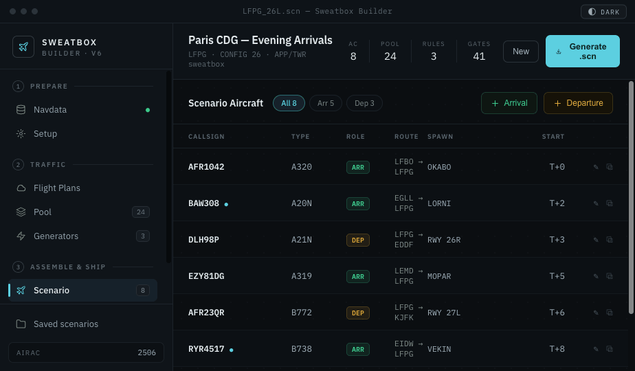
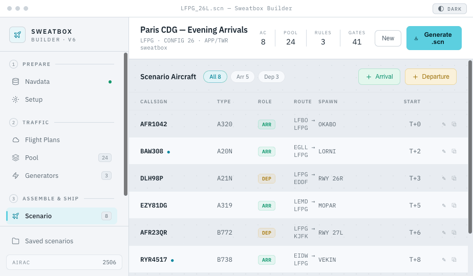

<div align="center">

# ✈️ Sweatbox Builder

**Build EuroScope sweatbox training scenarios without the busywork.**

Describe the traffic you want, hit generate, and get a ready-to-fly `.scn` file —
no hand-editing scenario text, no fiddly EuroScope encoding.

[](https://github.com/FlyingfrogFR/Sweatbox-Builder/actions/workflows/build.yml)
&nbsp;·&nbsp; [**⬇ Download the latest release**](https://github.com/FlyingfrogFR/Sweatbox-Builder/releases)

 

</div>

---

## The gist

If you mentor on VATSIM/IVAO, you know the drill: a good **sweatbox** session needs
a scenario file full of AI traffic, and writing those `.scn` files by hand is a pain.
Every aircraft wants a position, squawk, route, spawn heading, timing… all in
EuroScope's exact format, and one typo and it won't load right.

Sweatbox Builder does that part for you. Load your sector data, set up a few **rules**
— like _"arrivals over OKABO for 26L, 10 an hour for 45 minutes, mediums and heavies"_
— and it spits out properly-formatted traffic and exports a `.scn` you can drop
straight into EuroScope. All the gnarly bits (spawn-heading encoding, squawks,
holdings, altitude requests, pseudo-pilots) are handled under the hood.

It's a real desktop app — double-click and go. No browser, no setup server.

## What it does

- **Generate traffic from rules**
  - **S1 Ground** — single-airport ground scenarios with smart stand assignment (RampAgent / ESE gates), departures, arrivals and VFR
  - **S3 Approach** & **C1 Enroute** — rule-driven terminal/enroute traffic in a tidy workbench: a session timeline, your rule list, a live preview of what each rule produces, and an inline editor
  - **S2 Tower** — coming later (placeholder for now)
- **Bring your own navdata** — drop in EuroScope `.sct` / `.ese` files (waypoints, runways, STARs, gates), plus optional VAC France RampAgent stand data for gate-fit-aware parking
- **Pull real flight plans** — grab routes from **SimBrief** and **VATSIM live** right into an aircraft pool (works straight away — no CORS proxy to babysit)
- **EuroScope-correct output** — the heading encoding, squawk modes (including `56XX` and Mode-S fallbacks), holdings, altitude requests, pre-entry offsets and ground-speed handling all match what EuroScope expects
- **Native save** — writes your `.scn` and ruleset `.json` straight to disk, auto-named `ICAO_X.Y_CONFIGYY`
- **Looks the part** — light/dark themes, clean typography, fully offline
- **Reuse everything** — save and share scenarios, pools and rulesets as JSON

## Get it

Head to [**Releases**](https://github.com/FlyingfrogFR/Sweatbox-Builder/releases) and grab:

- **Windows** — the `.msi` or NSIS `.exe` installer (or just run the standalone `.exe`)
- **macOS / Linux** — build it yourself for now (see below)

> Each version tag (`vX.Y.Z`) kicks off a build that attaches the Windows installers automatically.

## Try it from source

```bash
npm install
npm run tauri:dev      # opens the app with hot reload
```

Then it's: **Navdata** (load your `.sct`/`.ese`) → **Generators** (add rules → _Apply all_)
→ **Scenario** (eyeball it) → **Export** (save the `.scn`). Done.

---

## For developers

### You'll need
- **Node.js** 18+ and npm (built on Node 22)
- **Rust** via [rustup](https://rustup.rs/) (stable, 1.77.2+)
- **Tauri v2 OS deps** — see <https://v2.tauri.app/start/prerequisites/>
  - **Windows:** MSVC C++ Build Tools (“Desktop development with C++”) + WebView2 (already on Win 10/11)
  - **macOS:** Xcode Command Line Tools
  - **Linux:** `webkit2gtk-4.1`, `gtk3`, `librsvg2`, `libsoup-3.0`, …

### Handy commands
```bash
npm run tauri:dev     # native dev window (hot reload)
npm run tauri:build   # app + installers (.msi/NSIS on Windows, .dmg on macOS, .deb/.AppImage on Linux)
npm test              # byte-for-byte generation regression suite (Vitest)
npm run dev           # front-end only, http://localhost:1420
npm run build         # production web build into dist/
npm run lint          # ESLint
npm run fixtures      # regenerate golden .scn fixtures from the oracle
```

### Builds in CI
`.github/workflows/build.yml` runs the tests on every push, and builds the Windows
installers **on demand** (Actions → *CI & Build* → **Run workflow** → grab the
`sweatbox-builder-windows` artifact) or **on a `v*` tag** (installers attached to a
Release). Heads-up: a plain push only runs the quick test job — it doesn't rebuild the
installers.

### No CORS proxy on desktop
The old browser prototype needed a localhost proxy to reach FlightPlanDatabase /
SimBrief / VATSIM. The desktop build sends those through the **Tauri HTTP plugin**
(native requests, no CORS), with hosts allow-listed in
`src-tauri/capabilities/default.json`. The proxy files in `reference/` only stick
around for an optional web build.

### Layout
```
reference/   The original single-file prototype (kept as the regression "oracle")
src/
  core/      Generation logic, ported VERBATIM (generateSweatbox, generateFromRule, ground, geo, …)
  generators/ ES-module plugin registry + S1/S2/S3/C1 generators
  panels/    Tab panels + App shell (sidebar, titlebar, context strip)
  parsers/   .sct / .ese parsers
  net/ io/ state/ ui/   HTTP + APIs, file save/bundles, localStorage, icons
src-tauri/   Rust backend: tauri.conf.json, capabilities/, src/lib.rs, icons/
tests/       Regression harness (oracle in a VM) + golden fixtures + Vitest
docs/        Screenshots
```

### Add a generator
Generators are plain ES modules registered with `registerGenerator({ id, label, render })`.
Make `src/generators/mygen.tsx`, call `registerGenerator(...)`, add `import "./mygen";`
to `src/generators/index.ts`, and it shows up in the Generators tab. (`src/generators/s3.tsx`
is the full reference.)

### Why the output is trustworthy
The generation code was ported **verbatim** from the original prototype, which lives in
`reference/` as the "oracle." The test harness runs that original code in a Node VM with
a seeded RNG, records its exact `.scn` output as golden fixtures, and checks the ported
app reproduces them **byte-for-byte** — so the new app generates exactly what the proven
prototype did.

```bash
npm test            # run the parity suite
npm run fixtures    # regenerate goldens from the oracle after intended changes
```

> Navdata isn't shipped — you load your own sector files. The tests make up minimal
> navdata so they stay self-contained.
